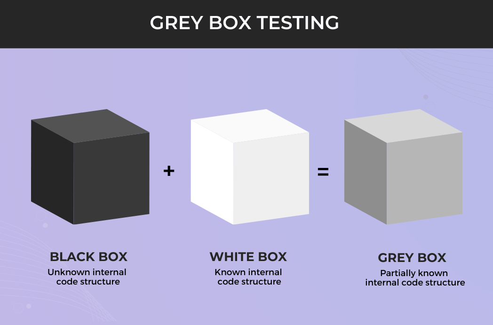
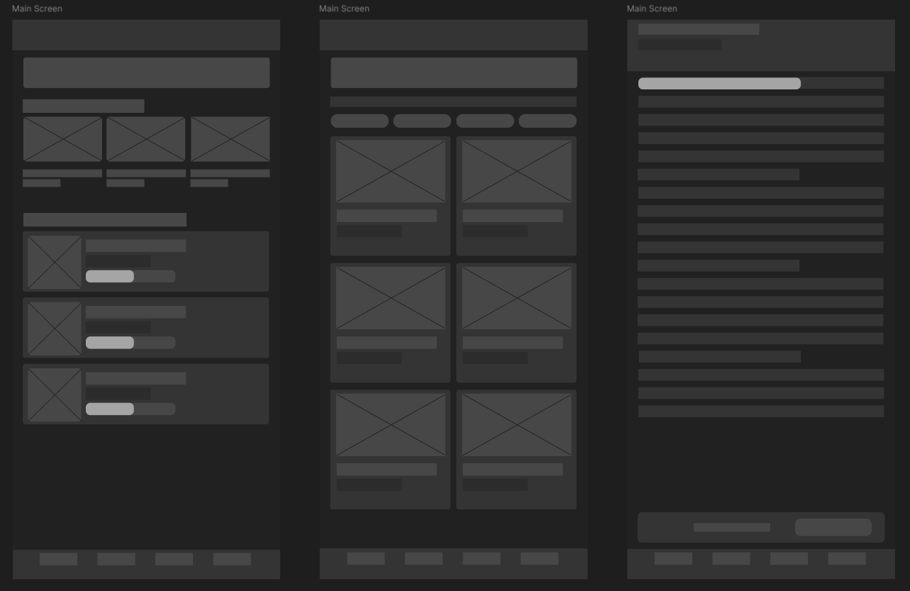

# Лабораторна робота №5
## Дисципліна: Основи UX/UI дизайну
## Тема: Проєктування архітектури та створення вайрфреймів у Figma. Від User Flow до Low-fidelity прототипу
### Виконав: студент групи РПЗ-33, Лобатенко Дмитро

### Мета роботи:
1. Навчитися перетворювати результати досліджень (User Stories та CJM) у конкретну логічну структуру (User Flow).  
2. Опанувати інструментарій Figma для створення низькодеталізованих макетів (Low-fidelity Wireframes).  
3. Закріпити навички роботи з сітками, типографікою та ієрархією компонентів без використання кольору.  
4. Створити «скелет» майбутнього проєкту, який базується на потребах реальних користувачів.

### Матеріальне забезпечення занять:
1. Персональний комп'ютер, доступ до мережі Інтернет.  
2. Обліковий запис Google.  
3. Середовища Figma та FigJam.

### Завдання для попередньої підготовки.

**1. Розглянути матеріали лекції №4. Зробіть короткий словник (5-7 термінів) базових понять англ. мовою.**

_Словник базових понять англ. мовою_

| № | Слово | Пояснення |
| :--- | :--- | :--- |
| 1 | Prototyping | Процес перетворення ідеї на конкретну модель — від паперового начерку до клікабельного макету — щоб перевірити логіку та зручність ще до написання коду |
| 2 | Fidelity | Рівень деталізації прототипу: наскільки він близький до фінального вигляду продукту. Чим вищий fidelity — тим більше деталей, але й більше часу на створення |
| 3 | User Flow | Покрокова схема шляху користувача до досягнення певної мети — від точки входу до результату. Аналог алгоритму в програмуванні: є вхід, логіка переходів і вихід |
| 4 | Task Flow | Вужча схема, що описує конкретне невелике завдання всередині загального User Flow. Використовується, щоб не перевантажувати головну схему зайвими деталями |
| 5 | Wireframe | Статичне чорно-біле зображення екрана, яке показує де що знаходиться, без кольорів і стилів. Це «кістяк» інтерфейсу |
| 6 | Wireflow | Кілька вайрфреймів, з'єднаних стрілками переходів — дозволяє показати і структуру екранів, і логіку їх зміни одночасно |
| 7 | Interactive Prototype | Вайрфрейм або макет із налаштованими переходами між екранами, який веде себе як справжній додаток при кліках та свайпах |

**2. Дайте відповіді на наступні питання:**

<blockquote>

**2.1. Чим Task Flow відрізняється від User Flow?**

**User Flow** — це широка картина: весь шлях користувача від входу в додаток до досягнення мети, з усіма розгалуженнями та точками рішень.  
**Task Flow** — це вирізана з цієї картини конкретна ділянка: наприклад, лише процес пошуку книги або лише процес додавання нотатки.  
Різниця — в масштабі. Task Flow потрібен тоді, коли якийсь вузол у загальній схемі стає занадто складним і його зручніше розписати окремо, щоб не перетворити User Flow на нечитабельну «павутину».

**2.2.** ***Чому вайрфрейми зазвичай виконуються у відтінках сірого?**

Кілька причин, і кожна практична. По-перше, сірий змушує фокусуватися на структурі та ієрархії — де що розташоване і що важливіше — без відволікання на кольори та шрифти. По-друге, команді та замовнику простіше коментувати «не те» розташування кнопки, коли вайрфрейм сірий: якщо б він виглядав як готовий дизайн, більшість зауважень зводилась би до «мені не подобається цей відтінок синього». По-третє, вносити правки на цьому етапі — справа хвилин, а не годин.

**2.3.** ****Що таке «Grey Box Method» у прототипуванні?**

**Grey Box Method** — підхід, при якому весь контент замінюється сірими прямокутниками різних розмірів. Зображення — перекреслений квадрат. Текст — набір горизонтальних ліній. Кнопка — прямокутник із підписом. Це дозволяє швидко розставити елементи по екрану і відразу побачити, чи є логіка в їх розташуванні — до того, як хтось почне малювати красиві іконки.

</blockquote>

**3. Познайомтесь з поняттям Layout Grid:**
- [https://www.geeksforgeeks.org/css/grids-in-figma/](https://www.geeksforgeeks.org/css/grids-in-figma/)
- [Master Responsive Grids (Rows & Columns) in Figma](https://www.youtube.com/watch?v=sybtdc4dYzE)
- [Figma for Edu: Layout grids](https://www.youtube.com/watch?v=HA2QoXu2K_Q)
- [Layout Design - How To Use Grids In Figma](https://www.youtube.com/watch?v=DK4_DcCS_WA)
- [Layout Grid | Grids in Figma](https://www.youtube.com/watch?v=QU3bAB3jfVA)

**Підготувати в електронному вигляді початковий варіант звіту:**  
- Титульний аркуш, тема та мета роботи  
- Відповіді до завдань для попередньої підготовки

## Хід роботи

### Практичне завдання №1. Побудова логіки (User Flow / Task Flow) (базовий рівень)

**1. Розглянути додаткові навчальні матеріали та приклади:**
- [Як створювати ефективні USER FLOW в UX-дизайні | 22 урок курсу UX](https://www.youtube.com/watch?v=SL2MLfsZQn0&t=85s)
- [How To Make User Flow In Figma (Easiest Way) (2026 Guide)](https://www.youtube.com/watch?v=sVEE6JLHBw8)
- [how to make user flow in figma](https://www.youtube.com/watch?v=nCohgD-If5Q)
- [How To Use FigJam To Create User Flow (2026 Guide)](https://www.youtube.com/watch?v=kYa1wiYI_oI)

**2. На основі ваших User Stories та CJM (див. ЛР №4) у FigJam або Figma розробіть схему руху користувача для основного сценарію:**
- Позначте початок і кінець (овали).
- Відобразіть екрани (прямокутники) та дії користувача (стрілки з підписами).
- Обов'язково додайте хоча б одну точку прийняття рішення (ромб), наприклад: «Чи ввів користувач пароль вірно?» → ТАК/НІ.

Схема охоплює основний сценарій: вхід до застосунку → авторизація → пошук книги → додавання до полиці. Ключова точка рішення — перевірка введених даних при авторизації: у разі помилки користувач повертається на екран входу, при успішному вході — переходить на головний екран. Ще одна точка розгалуження — наявність акаунту: новий користувач іде на реєстрацію, наявний — одразу на вхід.

[Посилання на дошку FigJam](https://www.figma.com/board/ВСТАВИТИ_ПОСИЛАННЯ)

### Практичне завдання №2. *Створення Low-fidelity вайрфреймів (базовий рівень)

**1. Розглянути додаткові навчальні матеріали та приклади:**
- [СЕКРЕТИ ЕФЕКТИВНОГО ПРОТОТИПУВАННЯ В UX: який прототип обрати та як створити | 23 урок UX](https://www.youtube.com/watch?v=tCEOZYR9O6E)
- [How to Wireframe in Figma in 2026](https://www.youtube.com/watch?v=qWIdforZ9x0) (дуже круте відео)
- [Figma Wireframe in 7 Minutes for Beginners in 2025 (Figma Tutorial)](https://www.youtube.com/watch?v=UEsrr6FmZ-U)
- [Design a Low Fidelity Prototype in Figma](https://www.youtube.com/playlist?list=PLfA4SdpraCK0WsYcyCh8r39YpbZY3XpLC)

**2. Створіть 3–5 екранів вашого додатку/сервісу у форматі Low-fi Wireframes.**

**3. Обов'язкові екрани:**
- Головний екран.
- Екран виконання основної функції (згідно з вашою ідеєю).
- Екран успішного завершення дії (Success State).

На основі User Flow було спроєктовано три ключові екрани BookShelf у форматі Low-fi. Головна мета — перевірити розташування елементів та інформаційну ієрархію до того, як з'являться кольори та реальний контент. Усі екрани виконані методом Grey Box: зображення — перекреслені прямокутники, текст — горизонтальні блоки різної ширини. Три екрани: Home (полиця + рекомендації), Search (пошук з фільтрами та сіткою результатів) та Reader (режим читання з прогрес-баром та нотатками).

**Style Guide:**

 

**Low-fi макети екранів:**

**4. Дослідіть питання, які є рекомендації щодо створення вайрфреймів з Layout Grid для різних пристроїв? Як ви їх врахували у своєму дизайні?**

Для мобільного застосунку використовується 4-колонкова сітка з 8px відступами між колонками — це стандартний підхід для екранів шириною 360–390px. Я застосував цю сітку у своєму дизайні: картки книг займають рівно 2 колонки кожна, а список результатів пошуку — всі 4. Усі padding'и та відступи між блоками кратні 8px — це дає відчуття «повітря» і полегшує адаптацію під різні розміри екранів у майбутньому. Кнопки суворо вирівняні по межах колонок, що робить передачу макету розробнику однозначною.

[Посилання на проєкт у Figma](https://www.figma.com/design/ВСТАВИТИ_ПОСИЛАННЯ)

### Практичне завдання №3. *Наповнення контентом та High-fi Wireframing (середній рівень)

**1. Перетворіть свої Low-fi начерки на High-fidelity Wireframes:**
- Замініть абстрактні лінії на реальний текст (ніякого Lorem Ipsum!).
- Використовуйте стандартні іконки (можна взяти плагіни Iconify або Feather Icons).
- Пропрацюйте ієрархію: заголовки мають бути жирнішими та більшими за основний текст.

На цьому кроці сірі блоки отримали реальний зміст: назви книг («Кобзар», «Dune», «Майстер і Маргарита»), імена авторів, відсотки прогресу. Це одразу показало кілька речей, яких не видно на Low-fi: назва «Майстер і Маргарита» не вміщується в одну колонку картки — довелося переглянути ширину; прогрес-бар виглядає занадто тонким і його важко помітити — збільшив висоту. Для навігаційної панелі обрані мінімальні іконки зі стандартного набору, кожна підписана. Ієрархія побудована на трьох рівнях: H1 (24px) для назв великих блоків, H2 (18px) для заголовків карток, Body (12px) для описів.

**High-fi макети екранів:**

**2. Вкажіть розміри основних елементів, які були використані у вашому дизайні.**

За основу взята типографічна шкала з кроком Major Third (×1.25), що забезпечує чітку візуальну ієрархію без надмірного розкиду розмірів на невеликому мобільному екрані.

Параметри типографії:
- **Інтерліньяж основного тексту**: 1.4 (17px при font-size 12px) — рядки не злипаються, текст легко читається навіть у режимі читання книги.
- **Інтерліньяж заголовків**: 1.2 (29px при H1 24px) — компактно, але з достатнім «повітрям».

| Елемент | Розмір (px) | Де застосовано |
| :--- | :--- | :--- |
| H1 (Heading) | 24 px | Назва застосунку, заголовки розділів «Продовжити читання» |
| H2 (Sub-heading) | 18 px | Назви книг у картках на головному екрані |
| H3 (Section title) | 14 px | Підзаголовки, ім'я автора |
| Body text | 12 px | Опис книги, мета-дані (жанр, рік), текст у режимі читання |
| Caption | 10 px | Підписи під іконками Tab Bar, відсотки прогресу |

[Посилання на проєкт у Figma](https://www.figma.com/design/ВСТАВИТИ_ПОСИЛАННЯ)

### Контрольні запитання

**1. Який елемент вайрфрейму вказує на те, що тут буде зображення?**

Стандартний плейсхолдер для зображення — прямокутник із двома діагональними лініями від кута до кута. Він не описує, яке саме зображення тут буде, але чітко повідомляє: тут буде графіка, а не текст. Це допомагає команді і замовнику одразу бачити, де в дизайні «живуть» візуальні елементи.

**2. Навіщо використовувати реальні тексти замість "Lorem Ipsum" на етапі High-fi вайрфреймів?**

Lorem Ipsum ховає реальні проблеми: коли підставляєш справжні назви, відразу бачиш, що «Тіні забутих предків» не вміщуються в картку, а «OK» займає половину кнопки і виглядає порожньо. Реальний контент перевіряє, чи витримує ієрархія навантаження живими даними, чи не ламається верстка при довгих рядках. Крім того, замовнику значно простіше оцінити продукт, коли він впізнає в ньому свій контент.

**3. Що таке "Happy Path" у сценарії користувача?**

**Happy Path** — це ідеальний маршрут: користувач робить все правильно, система відповідає без помилок, і він досягає мети найкоротшим шляхом. У BookShelf це виглядає так: відкрив → увійшов → знайшов книгу → додав до полиці → почав читати. Ніяких «невірний пароль» або «немає інтернету». Проєктування Happy Path першим — стандарт, але після нього обов'язково треба опрацювати і помилкові сценарії.

**4.** ***Як Layout Grid допомагає у передачі макета розробнику?**

Сітка — це спільна мова між дизайнером і розробником. Коли всі відступи кратні 8px і елементи прив'язані до колонок, розробник бачить не «ось тут десь 13 пікселів», а чітку систему: `padding: 16px`, `gap: 8px`, `width: 2-of-4 columns`. Це прибирає розбіжності між макетом і реалізацією і скорочує кількість запитань типу «а тут скільки відступ?».

**5.** ****Чому важливо проєктувати екран "Success State" (успіх), якщо дія відбувається на сервері?**

Без Success State користувач не знає, чи спрацювало. Він натискає кнопку ще раз — і отримує дублікат. Або думає, що щось зламалось, і іде. Success State — це зворотний зв'язок: «ми отримали, все добре, можна рухатись далі». У BookShelf це момент, коли книга додана до полиці — без підтвердження користувач може натиснути «Додати» тричі й не зрозуміти, чому в бібліотеці три однакові книги.

## Conclusions

&nbsp;&nbsp;&nbsp;In this laboratory work, I went through the full transition from research artifacts to a concrete interface structure. The User Flow built on top of the User Stories and CJM from the previous lab showed how a decision tree maps onto screen transitions — something that is easy to say in theory but actually takes some thought to draw correctly.  
&nbsp;&nbsp;&nbsp;The Low-fi stage was faster than expected once I stopped trying to make it look good and just focused on placing the right blocks in the right order. The jump to High-fi wireframes then revealed a few layout issues that the grey boxes had hidden — most notably with long Ukrainian book titles that do not fit neatly into card components designed for short English strings.  
&nbsp;&nbsp;&nbsp;The 4-column grid with 8px spacing made the whole structure significantly more consistent and will save time when handing off to a developer. Overall this stage turned the BookShelf idea from a concept into something that looks and behaves like a real product skeleton.
