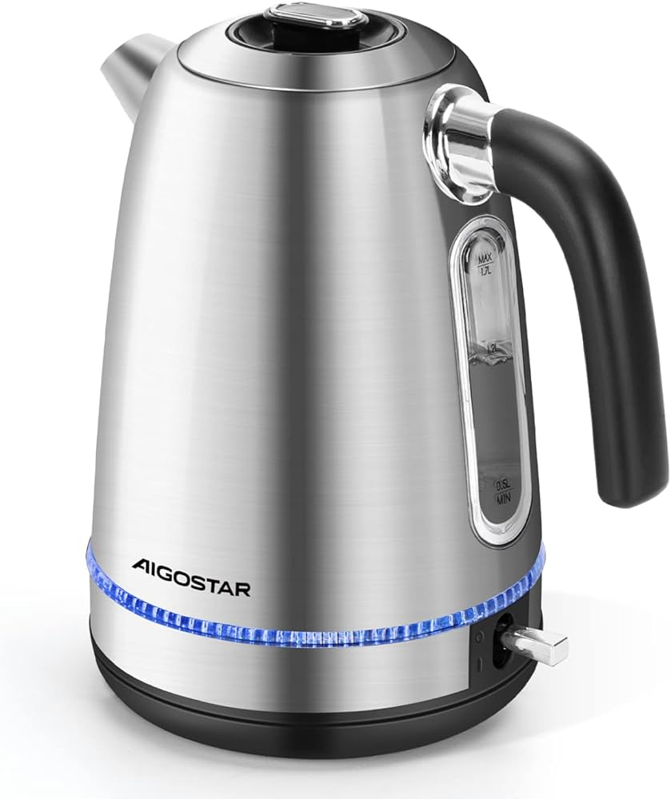

# Лабораторна робота №1
## Дисципліна: Основи UX/UI дизайну
## Тема: “Аналіз UX/UI дизайну предметів та інтерфейсів у повсякденному житті”
### Виконав: студент групи РПЗ-33, Лоботенко Дмитро
---
### Мета роботи:   
1. Закріпити розуміння різниці між UX та UI дизайном.  
2. Навчитися аналізувати інтерфейси реальних об’єктів та цифрових продуктів.  
3. Розвинути критичне мислення щодо ефективності та зручності дизайну.

### Матеріальне забезпечення занять:  
1. Персональний комп'ютер, смартфон, доступ до мережі Інтернет, папір та ручка (або графічний редактор)  
2. Будь-який побутовий прилад (для аналізу)

### Завдання для попередньої підготовки.

**1. Розглянути матеріали лекції №1:**

 
<blockquote>
  
1.1. [UI/UX Explained In 8 Minutes](https://youtu.be/ODpB9-MCa5s?si=bYFRXoR9JFN4lk2O) 
1.2. [Урок 1 Основи UI UX Що таке UI UX Design](https://youtu.be/1JM1INKTWvk?si=y_GxEqmbQKAr1HEX)

</blockquote>
  
**2. Зробіть короткий словник (5-7 термінів) базових понять англ. мовою.**

_Словник базових понять англ. мовою_

| № | Слово | Пояснення |
| :--- | :--- | :--- |
| 1 | **User Interface (UI)** | Зовнішнє оформлення продукту, з яким взаємодіє користувач (кольори, шрифти, форми) | 
| 2 | **User Experience (UX)** | Сукупність відчуттів та досвіду, що виникають під час користування продуктом | 
| 3 | **Affordance** | Властивість об'єкта, яка підказує користувачеві, як саме ним можна керувати | 
| 4 | **Accessibility** | Доступність інтерфейсу для всіх груп користувачів, включаючи людей з обмеженнями | 
| 5 | **Human-Centered Design** | Процес проєктування, що базується на потребах та психології людини | 
| 6 | **Prototyping** | Створення інтерактивної моделі майбутнього інтерфейсу для перевірки ідей | 

**3. Дайте відповіді на наступні питання:**

<blockquote>
   
**3.1. Дайте визначення поняттю "Інтерфейс".**

**Інтерфейс** — це спільна межа або спосіб зв’язку між двома системами. У дизайні це набір засобів, за допомогою яких людина керує технічним пристроєм чи програмою.

**3.2. Розшифруйте абревіатури UI та UX.**

**User Interface (UI)** — інтерфейс користувача. Це візуальна оболонка продукту: кожна кнопка, відступ, колірна схема та іконка.  
**User Experience (UX)** — досвід користувача. Це логіка роботи додатка, його зрозумілість, структура та емоції, які він викликає.

**3.3. Назвіть три основні види інтерфейсів, згадані в лекції (CLI, GUI, NUI/Voice/Gesture).**

**Command Line Interface (CLI)** — текстова взаємодія, де всі дії виконуються шляхом введення текстових команд у консоль.  
**Graphical User Interface (GUI)** — візуальна взаємодія через вікна, меню та графічні елементи, якими можна керувати мишкою чи тачем.  
**Natural User Interface (NUI)** — природна взаємодія за допомогою голосу, жестів або дотиків, що імітує людську поведінку.

***3.4.** **Чим відрізняється робота UI-дизайнера від UX-дизайнера при розробці вебсайту?**

**UX-дизайнер** — це архітектор і дослідник. Він вивчає потреби аудиторії, малює шляхи користувача, створює структуру сторінок (вайрфрейми) та дбає, щоб шлях до покупки чи реєстрації був найкоротшим і найпростішим.  
**UI-дизайнер** — це візуалізатор. Він бере структуру від UX-дизайнера і втілює її в кольорі, підбирає стильні шрифти, малює гарні іконки та створює анімації. Його мета — зробити сайт естетично привабливим та брендованим.

***3.5.** **Наведіть приклад "поганого дизайну" з повсякденного життя (коли річ гарна, але незручна).**

Скляний заварник для чаю з дуже короткою та тонкою ручкою. Він виглядає стильно й мінімалістично на кухні, але коли чай гарячий, ручка нагрівається, а через малий розмір пальці торкаються розпеченого скла. Дизайн гарний, але користуватися ним без опіків неможливо — це помилка в UX.

***3.6.** **Поясніть принцип "Form follows function" (Форма слідує за функцією) своїми словами.**

Це означає, що зовнішній вигляд предмета має визначатися його призначенням. Спочатку ми проектуємо зручне сидіння, а потім надаємо йому красивої форми. Якщо форма заважає виконувати функцію, такий дизайн є невдалим. Функціональність — це фундамент, а естетика — його завершення.

****3.7. **Як, на вашу думку, поганий UX впливає на технічну частину розробки ПЗ (наприклад, на навантаження на техпідтримку або кількість помилок у базі даних)?****

Поганий UX генерує "цифровий шум". Якщо користувач не розуміє, куди натиснути, він починає хаотично клікати на всі елементи, створюючи зайві запити до сервера. Якщо форми вводу незрозумілі, база даних наповнюється некоректними чи дубльованими записами. Це призводить до того, що служба підтримки тоне у зверненнях типу "я не можу оформити замовлення", хоча технічно сайт працює. Таким чином, розробники замість нових фіч витрачають час на очищення бази та виправлення наслідків незрозумілого інтерфейсу.

****3.8. **Чи може існувати UX без UI? (Згадайте голосові помічники або датчики руху). Аргументуйте.****

Так, UX може існувати без візуального інтерфейсу (UI). Коли ви підходите до автоматичного крана у ТЦ і вода починає текти — це UX (ви отримуєте результат взаємодії). Ви не бачите кнопок чи екрана, але відчуваєте зручність чи роздратування (якщо сенсор не спрацював). Голосовий інтерфейс — це суцільний досвід (UX), де замість очей працюють вуха, а замість рук — голос. Це доводить, що досвід взаємодії є ширшим поняттям, ніж просто картинка на моніторі.

</blockquote>

## Хід роботи

### Практичне завдання №1. "Реверс-інжиніринг" побутового приладу

**Об'єкт аналізу:** розумний електрочайник з керуванням через смартфон.

| Складова | Опис елементів (Що ви бачите/відчуваєте?) | Яку проблему це вирішує? (Інженерна/Користувацька мета) |
| :--- | :--- | :--- |
| **UI (Вигляд)** | Світлове кільце в основі чайника, що змінює колір залежно від температури води (синій, жовтий, червоний) | Візуальна комунікація. Користувач здалеку бачить стан нагріву, не підходячи до приладу та не торкаючись корпусу |
| **UI (Матеріал)** | Подвійні стінки: внутрішня з нержавіючої сталі, зовнішня — з матового термостійкого пластику | Безпека та термоізоляція. Зовнішня частина залишається теплою, а не гарячою, що запобігає опікам та довше зберігає тепло |
| **UX (Логіка)** | Можливість вибору точної температури (40, 60, 80, 90°C) однією кнопкою на ручці | Спеціалізовані сценарії. Дозволяє готувати різні види чаю або дитяче харчування без необхідності чекати охолодження окропу |
| **UX (Розташування)** | Прозора шкала рівня води розташована безпосередньо за ручкою, але має підсвітку | Видимість. Користувач завжди знає, скільки води всередині, навіть у темний час доби, що запобігає вмиканню порожнього приладу |

### Практичне завдання №2. *Аналіз "Невидимого інтерфейсу" та Афордансу (фізичний світ)

**Об'єкт аналізу:** професійний кухонний ніж (шеф-ніж).

**1. UI (User Interface) — зовнішній вигляд та матеріали.**  

- **Матеріал.** Лезо з високовуглецевої сталі з сатиновим покриттям. Ручка виготовлена з композитного матеріалу G10 (склотекстоліт), що не боїться вологи.

- **Фактура.** Поверхня ручки має мікротекстуру, що нагадує переплетення тканини. Це створює шорсткість для надійного хвату.

- **Колір.** Лезо сріблясте, ручка чорна з металевими заклепками. Класичний вигляд підкреслює надійність та професійність інструменту.

- **Зносостійкість.** Надзвичайно висока. Сталь тримає заточку, а рукоятка не тріскається від миття в гарячій воді та не вбирає запахи продуктів.

**2. UX (User Experience) — досвід використання та ергономіка.**

- **Афорданс.** Форма ручки звужується біля леза, що інтуїтивно підказує "кухарський хват" (великий і вказівний пальці на лезі). Широке лезо дозволяє використовувати ніж як лопатку для перенесення нарізаних овочів.

- **Ергономіка.** Вага збалансована в точці з’єднання леза та ручки. Це зменшує навантаження на кисть при тривалій роботі. Якби ручка була занадто важкою, ніж би постійно "задирався" вгору, змушуючи м'язи руки перенапружуватися для втримання рівного зрізу.

### Практичне завдання №3. *Аналіз "Невидимого інтерфейсу" та Афордансу (Цифровий світ) 

- **UI (Інтерфейс користувача)**

- **Кольори.** Мінімалістична біло-чорна палітра інтерфейсу (або темна тема), яка не відволікає від основного контенту — фотографій та відео користувачів.

- **Розташування кнопок.** Основна навігація (Home, Search, Reels, Shop, Profile) знаходиться у нижній частині екрана. Це зона легкої досяжності великого пальця при триманні телефона однією рукою.

- **Шрифти.** Використовується фірмовий беззасічковий шрифт "Instagram Sans", який виглядає сучасно, легко читається у підписах та коментарях.

- **UX (Досвід користувача)**

- **Логіка навігації.** Циклічна та безкінечна. Свайп вгору в стрічці або Reels дозволяє споживати контент без зупинок. Перехід у профілі здійснюється одним кліком по імені.

- **Сценарії використання:**

1) Швидкий перегляд Stories (тапи по краях екрана); 
2) Лайк через подвійний тап по фото (економія рухів); 
3) Надсилання посту в Direct через іконку літачка.
  
- **Швидкість доступу до функцій.** Доступ до камери для створення сторіз реалізований свайпом вправо з головного екрана. Це забезпечує миттєвий перехід до дії, поки момент не втрачено.
  
**2. Приклад поганого афордансу**

Поширеною проблемою в сучасному веб-дизайні є використання так званих "Ghost Buttons" (кнопки-привиди) — це кнопки, які мають лише тонку рамку і прозорий фон.

Елемент: Кнопка підтвердження в анкеті.

Опис помилки: На білому фоні прозора кнопка виглядає як звичайне текстове поле або просто декоративний елемент. Користувач не сприймає її як клікабельну зону.

Це поганий афорданс, оскільки кнопка не має візуальної ваги та об'єму. Людина звикла, що кнопка — це щось, що височіє над поверхнею або має заливку. У стані стресу чи швидкого перегляду такий елемент просто "випадає" з поля зору. Виправлення: надати кнопці контрастну заливку або тінь, щоб вона виглядала як фізичний об'єкт, готовий до натискання.

### Практичне завдання №4. **Проєктування інтерфейсу майбутнього

**Назва технології:** "AeroGuide" (AR-навігація для професійних велогонщиків).

Це інтелектуальна система, що проєктує дані безпосередньо на лінзи окулярів гонщика, дозволяючи отримувати інформацію без відриву погляду від траси на великій швидкості.

**1. Спосіб введення (Input)**

Гонщик не може відпускати кермо, тому система базується на Eye-Tracking та датчиках на кермі.

**- Gaze Activation.** Перемикання між режимами (карта / пульс / швидкість) відбувається шляхом затримання погляду на кутових зонах окулярів.

**- Haptic Buttons.** Непомітні сенсорні зони під великими пальцями на кермі, що відчуваються через рукавиці завдяки вібровідгуку.

**2. Спосіб виведення (Output/Feedback)**

**- Visual (AR Overlay).** Віртуальна "блакитна лінія" на асфальті (як у відеоіграх), що показує ідеальну траєкторію входу в поворот залежно від швидкості.

**- Audio (Directional Sound).** Звук підказок ("Поворот через 50 метрів") подається так, ніби він іде з того боку, куди треба повернути.

**3. UI складова (Естетика та Вигляд)**

- **Стиль.** Ультра-мінімалізм. Тільки напівпрозорі лінії, щоб не засліплювати гонщика в сонячну погоду.

- **Кольори.** Адаптивні. Яскраво-жовтий при поганому освітленні, насичений блакитний — удень.

**4. UX сценарій (Задача: Спуск з гори на швидкості 70 км/год)**

**Порівняння:** <blockquote>

**Велокомп'ютер.** Гонщику треба опустити голову вниз, щоб подивитися на малий екран на кермі. Це забирає 1-2 секунди концентрації, що на такій швидкості може призвести до падіння.

**AeroGuide.** Гонщик бачить напівпрозору карту прямо перед собою. Система підсвічує ями на дорозі червоним кольором (через камери в шоломі) ще до того, як їх помітить людське око. Когнітивне навантаження мінімальне, оскільки дані інтегровані в реальність.

</blockquote>

### Контрольні запитання

**1. Що спільного між графічним дизайном плаката та інтерфейсом програми?**

Обидва базуються на правилах композиції, типографіки та візуальної ієрархії. Їхня спільна мета — керувати увагою глядача та максимально швидко донести головну думку через візуальні образи.

**2. Чому інженери ПЗ повинні розуміти основи дизайну?**

Програміст, що знає основи UX, створює більш стабільний код. Розуміння потреб користувача дозволяє передбачити помилкові дії на рівні архітектури, що зменшує кількість технічних багів та робить фінальний продукт конкурентоспроможним.

**3. Наведіть приклад предмета з добре продуманим UX.**

Звичайна кулькова ручка з ковпачком, що має кліпсу. Кліпса запобігає скочуванню ручки зі столу (UX-рішення), а характерне клацання при закритті дає звуковий зворотний зв'язок, що ручка не засохне.

***4.** **Ви розробляєте програму для заводу, де робітники працюють у товстих рукавицях. Які обмеження це накладає на UI та UX (розмір кнопок, тип екрану, жести)?**

Кнопки повинні мати велику площу натискання (мінімум 2х2 см) та значні відступи між ними. Потрібно уникати свайпів та дрібних перемикачів. Бажано дублювати екранні дії фізичними кнопками на корпусі пристрою.

***5.** **Проаналізуйте інтерфейс командного рядка (CLI). У чому його поганий UX для новачка, і в чому чудовий UX для адміністратора?**

Для новачка це "чорна діра" — немає жодної підказки, що можна зробити (нульовий афорданс). Для професіонала — це інструмент найвищої ефективності, де швидкість введення команди вища за пошук іконки в меню, а можливість автоматизації через скрипти робить досвід максимально продуктивним.

***6.** **Що таке "інтуїтивно зрозумілий інтерфейс"?**

Це дизайн, який не потребує навчання. Він використовує вже знайомі людині ментальні моделі (наприклад, іконка "смітника" для видалення), що дозволяє почати роботу миттєво.

****7.** **Уявіть ситуацію: користувачі постійно помиляються при вводі дати народження на сайті. Як це виправити засобами UI (візуал), а як — засобами UX (логіка)?**

UI-рішення: виділити поля кольором, додати чіткі текстові підказки всередині полів (placeholder). UX-рішення: змінити вільний ввід тексту на випадаючі списки або інтерактивний календар, що блокує некоректні дати.

****8.** **Як зміна контексту використання впливає на UX? (Порівняйте використання навігатора в телефоні, коли ви сидите на дивані, і коли ви їдете за кермом на швидкості 100 км/год).**

На дивані UX зосереджений на інформативності (ви можете читати відгуки про кафе на карті). За кермом UX зосереджений на безпеці та миттєвому зчитуванні — деталі зникають, залишаються лише величезні стрілки та голос, щоб мінімізувати відволікання від дороги.

## Conclusions

As a result of this laboratory work, I gained a comprehensive understanding of the distinct yet interconnected roles of UI and UX design. I learned that UI is the aesthetic "bridge" that enables interaction, while UX is the logical and emotional foundation of that journey.

By analyzing tools like screwdrivers and software like Spotify, I recognized the importance of affordance—the ability of an object to suggest its own use. I also realized that functionality must always precede decoration ("Form follows function"), as even the most beautiful interface is useless if it fails to solve the user's problem.

Finally, I understood that context is a critical design factor; a product's interface must adapt to the user's environment, whether it is a quiet room or a high-speed highway, to remain effective and safe.
