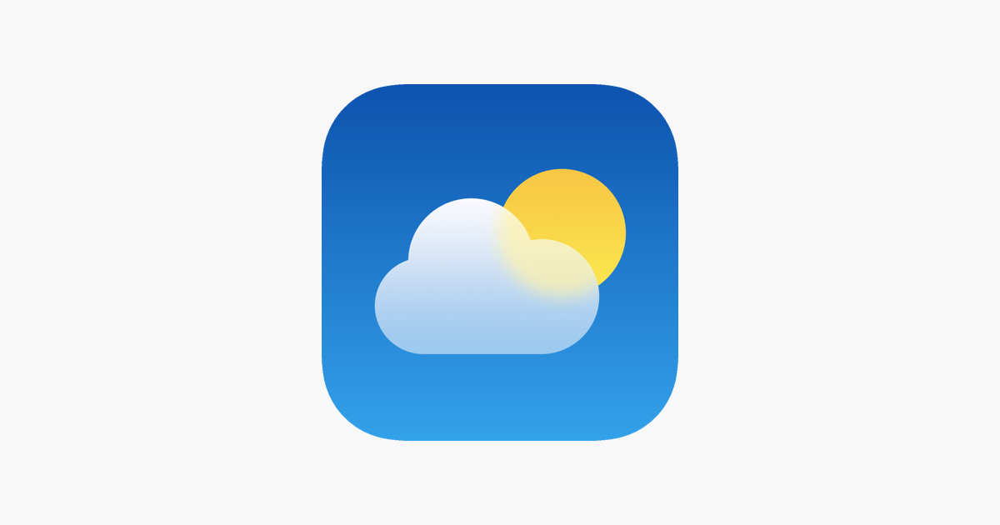
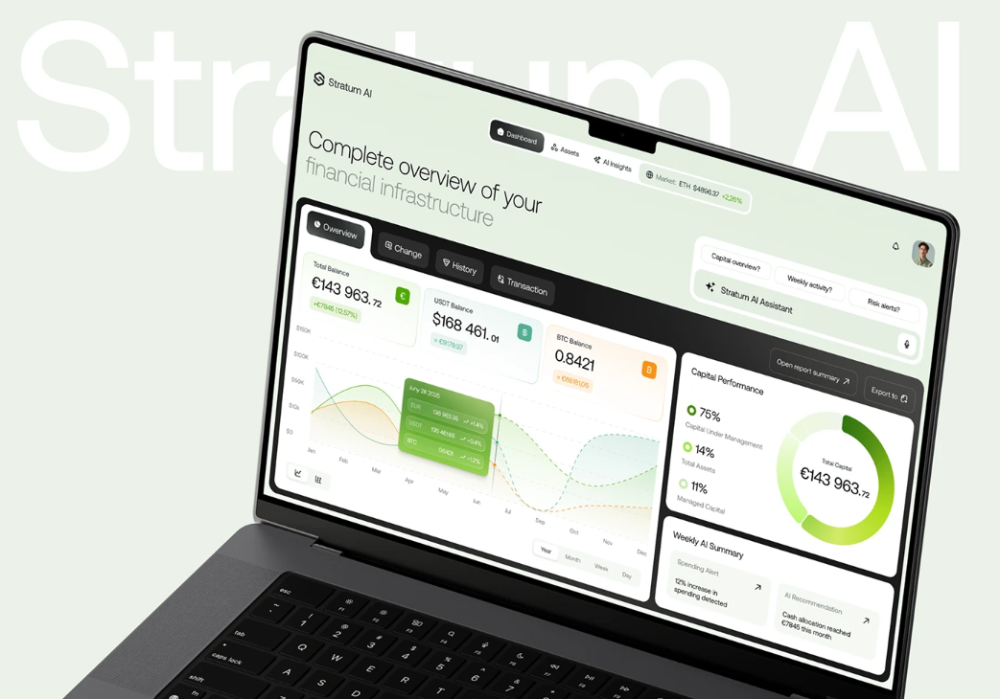
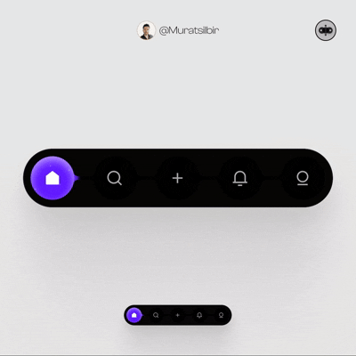
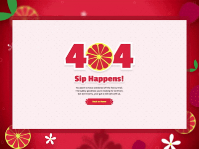

# Лабораторна робота №2
## Дисципліна: Основи UX/UI дизайну
## Тема: “Життєвий цикл розробки програмного продукту (SDLC). Аналіз ролей у команді та декомпозиція процесу створення інтерфейсу”
### Виконав: студент групи РПЗ-33, Лоботенко Дмитро
---
### Мета роботи:   
1. Закріпити знання про етапи життєвого циклу розробки ПЗ (SDLC) та місце дизайну в ньому.  
2. Навчитися ідентифікувати вузькоспеціалізовані ролі в IT-командах та їхні зони відповідальності.  
3. Розвинути навички реверс-інжинірингу (зворотного проєктування) — вміння розкладати готовий продукт на етапи його створення.  
4. Формувати професійну "надивленість" — здатність аналізувати чужі інтерфейсні рішення не на рівні "подобається/не подобається", а з точки зору функціональності та UX.

### Матеріальне забезпечення занять:  
1. Персональний комп'ютер, доступ до мережі Інтернет, смартфон (для аналізу додатків), браузер.  

### Завдання для попередньої підготовки.

**1. Розглянути матеріали лекції №2:**

 
<blockquote>
  
1.1. [Introduction To Software Development LifeCycle](https://www.youtube.com/watch?v=Fi3_BjVzpqk) 
1.2. [Введення у Web дизайн](https://www.youtube.com/watch?v=VdU81Kz9l6s)

</blockquote>

**2. Зробіть короткий словник (5-7 термінів) базових понять англ. мовою.**

_Словник базових понять англ. мовою_

| № | Слово | Пояснення |
| :--- | :--- | :--- |
| 1 | **SDLC** | Методологія, що описує всі кроки створення програмного продукту — від ідеї до випуску та супроводу |
| 2 | **Requirement Analysis** | Процес збору та деталізації вимог замовника для розуміння функціонала майбутньої системи |
| 3 | **SRS (Specification)** | Технічний документ, що описує поведінку системи та вимоги до її розробки |
| 4 | **Design Phase** | Створення архітектури проєкту та проєктування інтерфейсів (UI/UX) |
| 5 | **Implementation** | Безпосереднє написання програмного коду розробниками |
| 6 | **Software Testing** | Етап перевірки готового продукту на наявність багів та відповідність вимогам |
| 7 | **Maintenance** | Підтримка та оновлення продукту після його виходу на ринок |

**3. Дайте відповіді на наступні питання:**

<blockquote>

**3.1. Розшифруйте абревіатуру SDLC.**

**SDLC** — Software Development Life Cycle (Життєвий цикл розробки програмного забезпечення).

**3.2. Що таке "вайрфрейм" (wireframe) і на якому етапі він створюється?**

Це структурний макет сторінки (скелет), що визначає розташування блоків та логіку навігації без візуального оформлення. Створюється на стадії UX-дизайну в межах етапу Design Phase.

**3.3. Назвіть дві основні Hard Skills та дві Soft Skills, необхідні сучасному дизайнеру.**

**- Hard Skills:**

- Робота у графічних редакторах (Figma, Sketch).
- Розуміння принципів адаптивної верстки та UI-гайдлайнів.

**- Soft Skills:**

- Критичне мислення (аналіз проблем користувача).
- Вміння працювати в команді (співпраця з розробниками).

**3.4.** ***Чому етап UX-дизайну (проєктування логіки) має передувати етапу UI-дизайну (візуалізації)? Що станеться, якщо зробити навпаки?**

Спочатку потрібно розробити "карту" та логіку взаємодії (UX), щоб користувач міг досягти своєї мети. Якщо почати з UI, можна створити естетичний, але абсолютно нефункціональний продукт, переробка якого після верстки коштуватиме дуже дорого.

**3.5.** ***Опишіть процес передачі макету від дизайнера до розробника (Handoff). Що саме дизайнер має надати Frontend-розробнику окрім картинки макета?**

Дизайнер надає клікабельний прототип та доступ до макету (наприклад, Figma Dev Mode), де містяться специфікації: шрифти, колірна палітра, відступи, а також експортовані ресурси (іконки в SVG, фото) та описи станів кнопок.

**3.6.** ***У чому полягає різниця між ролями UX Researcher та UI Designer?**

UX Researcher фокусується на дослідженні аудиторії: проводить тести та інтерв'ю, щоб зрозуміти психологію користувача. UI Designer перетворює ці знання у візуальну форму: підбирає кольори, створює іконки та верстає фінальні екрани.

**3.7.** ****Як якісний UX-дизайн (наприклад, добре продумана валідація форм на клієнті) може знизити навантаження на Backend-сервер?**

Грамотний UX передбачає перевірку даних на стороні клієнта (Front-end validation). Якщо додаток вказує користувачеві на помилку в номері телефону ще до натискання "Відправити", серверу не доводиться обробляти некоректні запити, що економить обчислювальні ресурси.

**3.8.** ****Уявіть, що на етапі тестування (QA) виявлено, що верстка суттєво відрізняється від макета дизайнера. Які можуть бути причини цього і як запобігти цьому в майбутньому (з точки зору процесів)?**

Потрібно впровадити етап Design Review, де дизайнер перевіряє готову верстку на відповідність макету. Також критично важливо використовувати Design System, щоб розробники мали готові бібліотеки компонентів, ідентичні дизайнерським.

</blockquote>

## Хід роботи

### Практичне завдання №1. Інтеграція вузьких спеціалістів у SDLC (базовий рівень)

| Роль | Етап(и) SDLC | Пояснення |
| :--- | :--- | :--- |
| **UX Writer** | Design (UX/UI) | Розробляє зрозумілі тексти для інтерфейсу, повідомлення про помилки та підказки, забезпечуючиTone of Voice продукту |
| **Motion Designer** | Design (UI) | Додає анімовані переходи та мікровзаємодії, які роблять інтерфейс "живим" та інтуїтивним |
| **Accessibility Specialist** | Design & Testing | Гарантує, що продукт буде зручним для людей з порушеннями зору чи моторики, перевіряючи контрастність та підтримку скрінрідерів |
| **DevOps Engineer** | Implementation & Deployment | Налаштовує автоматизацію виходу оновлень (CI/CD), щоб новий дизайн швидше потрапляв до користувачів |
| **Business Analyst** | Requirement Analysis | Перетворює абстрактні бізнес-ідеї у конкретні вимоги для дизайнерів та технічне завдання для розробників |
| **Security Specialist** | Planning & Testing | Слідкує за захистом персональних даних користувачів на етапі проєктування та шукає вразливості перед релізом |

### Практичне завдання №2.*"Реверс-інжиніринг" процесу створення продукту (середній рівень)

**Об'єкт аналізу:** мобільний додаток "Погода" (Weather App).

- **Етап 1 (Аналітика):** Вивчення контексту. Користувачі дивляться погоду на ходу або зранку. Вимога: інформація про температуру та опади має бути на головному екрані.
- **Етап 2 (Референси):** Аналіз конкурентів (Apple Weather, AccuWeather). Висновок: найкраще працюють динамічні фони, що змінюються залежно від стану неба.
- **Етап 3 (UX-дизайн):** Створення вайрфреймів. Логіка свайпів між різними містами. Розробка детального прогнозу на 24 години та на тиждень.
- **Етап 4 (UI-дизайн):** Підбір градієнтів для різних станів (сонячно — помаранчевий, гроза — темно-фіолетовий). Створення набору погодних іконок.
- **Етап 5 (Прототипування):** Налаштування анімації хмар або дощу для залучення уваги користувача.
- **Етап 6 (Handoff):** Експорт іконок у SVG. Надання специфікацій шрифтів розробникам.
- **Етап 7 (Frontend розробка):** Верстка екранів, реалізація віджетів для головного екрана смартфона.
- **Етап 8 (Backend розробка):** Підключення API погодних сервісів для отримання даних у реальному часі.
- **Етап 9 (Тестування):** Перевірка коректності відображення даних у різних часових поясах та при відсутності мережі.
- **Етап 10 (Реліз):** Запуск у маркетах, збір відгуків про точність прогнозів.

### Практичне завдання №3. **Розвиток професійної надивленості (підвищений рівень) 

**1. Перейдіть на сайти професійних портфоліо та коротко опишіть їх. Як вони можуть знадобитись UX/UI-дизайнеру?**

- **Behance:** Дозволяє вивчати цілісні кейси, де видно не тільки фінальну картинку, а й процес дослідження та вайрфрейми.

- **Dribbble:** Найкраще підходить для пошуку мікровзаємодій, трендових UI-рішень та колірних палітр.

- **Awwwards:** Демонструє пік технологічних можливостей вебу та інноваційні способи навігації.

**2-3. Знайдіть на цих сайтах по 1 прикладу роботи на кожну з наведених нижче категорій (всього 3 роботи) і проаналізуйте їх. Для кожної роботи напишіть аналіз (2-3 речення)**

**- Складна вебформа / Дашборд (Behance):**
  
Робота: AI Finance Management Dashboard
Посилання: [AI Finance Management Dashboard](https://www.behance.net/gallery/242751321/Stratum-AI-UXUI-Branding-for-Finance-Management?tracking_source=search_projects|finance+managment+dashboard&l=0)

Аналіз: Дизайнер вдало збалансував величезну кількість статистичних даних (графіки витрат, AI-прогнози, транзакції) за допомогою карткової структури. Чітка ієрархія та використання акцентного кольору для головних метрик дозволяють користувачу миттєво зчитувати свій фінансовий стан.

**- Цікава навігація (Dribbble):**

Робота: Liquid Tab Bar Interaction
Посилання: [Liquid Tab Bar Interaction](https://dribbble.com/shots/26136769-Navigation-bar-liquid-style))

Аналіз: Використання "рідкої" анімації при перемиканні між розділами меню створює унікальний досвід взаємодії. Це не лише візуально привабливо, а й дає чіткий зворотний зв'язок (feedback) про те, який розділ зараз активний.

**- Сторінка 404 (Awwwards):**
  
Робота: Slack Interactive 404
Посилання: [Slack Interactive 404](https://www.awwwards.com/inspiration/404-micha-kombucha)

Аналіз: Сторінка містить анімований пейзаж з інтерактивними елементами, що перетворює технічну помилку на приємний ігровий досвід. Такий підхід знижує рівень роздратування користувача від невдалого пошуку.

### Контрольні запитання

**1.  Що таке інтерактивний прототип і чим він відрізняється від статичного макета?**

Клікабельна модель макета, що дозволяє протестувати сценарії використання до початку розробки.

**2.  Хто такий QA-спеціаліст і на якому етапі він підключається до роботи?**

Фахівець, що перевіряє якість коду та відповідність дизайну, шукаючи помилки.

**3.  Які інструменти (програми) найчастіше використовують сучасні UI/UX дизайнери?**

Figma, Adobe XD, Framer, Photoshop.

**4.** ***Поясніть своїми словами концепцію "T-shaped спеціаліста" в дизайні. Чому це актуально зараз?**

Це фахівець, що має глибокі знання в одній сфері (наприклад, UI) та розуміється на суміжних галузях (UX, маркетинг, верстка).

**5.** ***Навіщо потрібен етап "Експорт ресурсів" і що таке UI Kit / Styleguide, який дизайнер передає розробнику?**

Щоб надати програмістам всі візуальні елементи (картинки, іконки) у потрібних форматах.

**6.** ***Чому програмісти (Backend/Frontend) іноді конфліктують з дизайнерами? Наведіть приклад ситуації, коли дизайнер намалював щось "нереалізоване".**

Через малювання елементів, які технічно важко або неможливо реалізувати у межах бюджету чи часу.

**7.** ****Як ви вважаєте, чи повинен дизайнер знати основи HTML/CSS? Аргументуйте свою думку (як це допомагає або заважає в роботі).**

Так, це допомагає створювати макети, які технічно придатні для верстки.

**8.** ****Проаналізуйте ризики проєкту, в якому вирішили зекономити та пропустили етапи 1 (Аналітика) та 3 (UX-проєктування), одразу перейшовши до малювання гарних картинок (UI). До яких наслідків на етапі програмування та релізу це може призвести?**

Створення гарного, але абсолютно непотрібного або незручного продукту, що призведе до фінансових втрат.

## Conclusions

As part of this laboratory work, I studied the Software Development Life Cycle (SDLC) and identified the role of design within this framework. 
I realized that a professional UI/UX designer must look beyond aesthetics, considering technical feasibility and business requirements. 
By analyzing the "Weather App" through reverse engineering, I understood that logical UX structure must always form the core of any digital product before applying visual elements. 
Additionally, studying high-quality cases on Behance and Awwwards provided me with insights into how complex data can be effectively organized into intuitive dashboards. 
Overall, I concluded that successful development is only possible through close collaboration between designers, analysts, and developers at every stage of the lifecycle.

