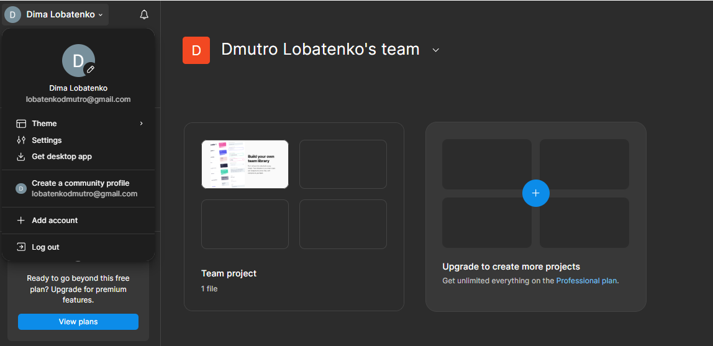
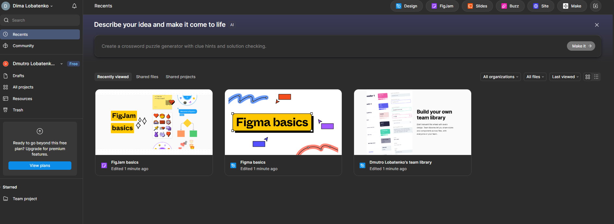
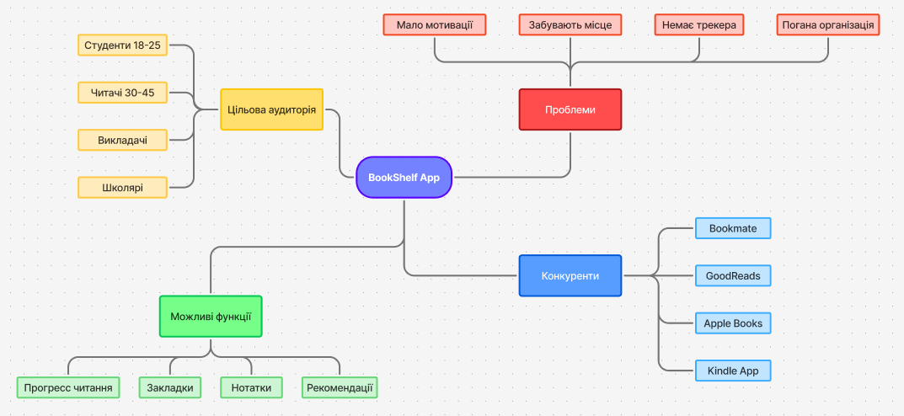
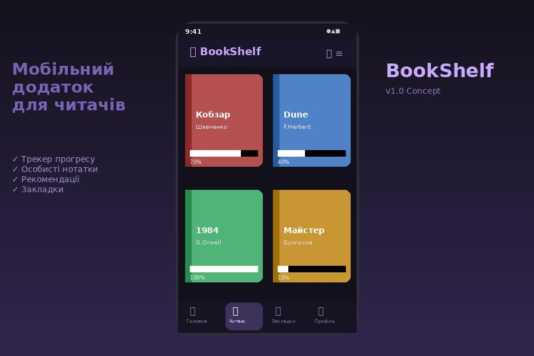
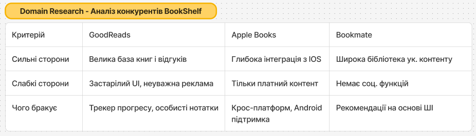
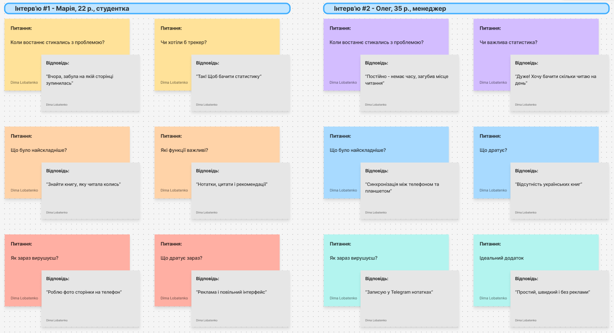

# Лабораторна робота №3
## Дисципліна: Основи UX/UI дизайну
## Тема: "Знайомство з Figma та FigJam та визначення теми комплексного проєкту"
### Виконав: студент групи РПЗ-33, Лобатенко Дмитро
---
### Мета роботи:   
1. Ознайомитися з можливостями Figma та FigJam (реєстрація під студентським акаунтом).  
2. Навчитися розрізняти інструменти для візуального дизайну та інструменти для досліджень. 

### Матеріальне забезпечення занять:  
1. Персональний комп'ютер, доступ до мережі Інтернет.  
2. Обліковий запис Google.  
3. Середовища Figma та FigJam.  

### Завдання для попередньої підготовки.

**1. Розглянути матеріали лекції №3.**

**2. Зробіть короткий словник (5-7 термінів) базових понять англ. мовою.**

_Словник базових понять англ. мовою_

| № | Слово | Пояснення |
| :--- | :--- | :--- |
| 1 | **UX Design (User Experience Design)** | Напрямок дизайну, що займається проєктуванням зручного досвіду взаємодії людини з продуктом. Фахівець з UX вивчає, як саме люди користуються продуктом, які труднощі виникають, та намагається усунути ці труднощі ще на етапі проєктування |
| 2 | **Design Thinking** | Метод вирішення задач через глибоке розуміння потреб користувача. Включає п'ять кроків: Empathize (зрозуміти), Define (сформулювати), Ideate (придумати), Prototype (зробити прототип) та Test (перевірити). Цей цикл може повторюватись кілька разів |
| 3 | **User Personas** | Узагальнені образи реальних користувачів, створені на основі досліджень. Кожна персона має ім'я, вік, мету та типові проблеми — це допомагає команді приймати дизайн-рішення, орієнтуючись на конкретну людину, а не абстрактного «юзера» |
| 4 | **Problem Statement** | Коротке формулювання, яке описує основну проблему користувача та причину її виникнення. Правильно складений Problem Statement не містить готових рішень — він лише чітко окреслює, що саме треба вирішити |
| 5 | **User Stories** | Невеликі описи задач користувача у форматі «Як [хто], я хочу [що], щоб [навіщо]». Допомагають команді розуміти, яку реальну цінність має приносити кожна функція продукту |
| 6 | **Customer Journey Map (CJM)** | Візуальна карта, що відображає весь шлях користувача під час взаємодії з продуктом — від першого знайомства до виконання мети. На карті фіксуються кроки, емоції та проблеми у кожній точці контакту |
| 7 | **Double Diamond** | Фреймворк проєктування, у якому процес ділиться на чотири фази: Discover, Define, Develop та Deliver. Назва «подвійний діамант» відображає чергування розширення (дивергенція) та звуження (конвергенція) думок на кожному етапі |

**3. Дайте відповіді на наступні питання:**

<blockquote>

**3.1. Яка головна різниця між Figma та FigJam (для яких завдань кожен інструмент кращий)?**

По суті, це два різних інструменти під різні задачі. **Figma** орієнтована на точну роботу з інтерфейсом: тут малюють макети, вибудовують компоненти, налаштовують прототипи. Це інструмент для тих етапів, де вже є чітке розуміння, що саме треба зробити.  
**FigJam** — це скоріше цифровий аркуш паперу для мозкового штурму. Тут зручно накидати ідеї, малювати схеми, розставляти стікери. Вона не призначена для пікселів — вона для думок.

**3.2. Що таке "Двері Нормана" і як це поняття пов'язане з емпатією до користувача?**

**"Двері Нормана"** — це побутовий приклад поганого дизайну: двері, на яких немає зрозумілої підказки, в який бік їх відчиняти. Людина штовхає — а треба тягнути. Проблема тут не в людині, а в дизайнері, який не подумав про того, хто буде цим користуватись. Саме тут і з'являється поняття емпатії — здатності поставити себе на місце користувача та передбачити, як він буде діяти, а не як «правильно» діяти за задумом автора.

**3.3.** ***Поясніть різницю між Domain Research та User Interview.**

| Тип дослідження | Що вивчає | Мета |
| :--- | :--- | :--- |
| Domain Research | Загальний контекст галузі: як влаштований ринок, які є гравці, які є обмеження | Зрозуміти правила гри в конкретній сфері до початку роботи з користувачами |
| User Interview | Особистий досвід конкретних людей: що вони роблять, де спотикаються, як вирішують проблеми зараз | Отримати живі інсайти від реальних людей, а не з вторинних джерел |

**3.4.** ***Чому на етапі дослідження важливо ставити питання "Чому?", а не просто фіксувати відповіді "Так/Ні"?**

- Закриті відповіді показують лише поверхню — дизайнера цікавить те, що під нею.
- Питання «Чому?» змушує людину пояснити свою поведінку, а не просто висловити думку.
- Таким чином можна докопатися до справжньої причини проблеми, а не займатися косметичними виправленнями продукту.

**3.5.** ****Чому UX-процес не починається з дизайну кнопок?**

Тому що кнопка — це вже відповідь. А щоб дати відповідь, спочатку треба зрозуміти питання. Якщо взятися за інтерфейс раніше, ніж зрозуміти, для кого він і навіщо — ризикуєш зробити щось красиве, але абсолютно непотрібне. UX-процес починається з дослідження саме для того, щоб не витрачати час на розв'язання хибної проблеми.

**3.6.** ****Що станеться з проєктом, якщо пропустити етап Empathy?**

Команда починає проєктувати на основі власних уявлень про те, чого хоче користувач. Це майже завжди призводить до продукту, який виглядає логічно зсередини, але не відповідає реальним потребам ззовні. Без емпатії неможливо скласти коректний Problem Statement — а значить, усі подальші рішення будуть будуватись на хибному фундаменті.

</blockquote>

## Хід роботи

### Практичне завдання №1. Знайомство з Figma та FigJam (базовий рівень)

**1. Створіть акаунт у Figma (бажано через Google-пошту). Подайте заявку на Student Education Plan (це дасть безкоштовний доступ до професійних функцій).**

 

 

 

**2. Створити по одному файлу у Figma та у FigJam**
 
| Figma |
| :--- | 
|  |

| FigJam |
| :--- | 
 |

**3. Порівняти можливості інструментів:**

| Критерій | Figma | FigJam |
| :--- | :--- | :--- |
| Основне призначення | Проєктування інтерфейсів: точні макети, компоненти, UI-системи | Спільна робота з ідеями: брейнсторм, схеми, дослідження |
| Компоненти | Повноцінні UI-компоненти з варіантами, авто-лейаутами та стилями | Базові фігури, стрілки та стікери для структурування ідей |
| Прототипування | Клікабельні прототипи з переходами, станами та анімацією | Можна намалювати схему flow, але без інтерактивності |
| Sticky notes | Нема нативних — зазвичай замінюють звичайними прямокутниками | Основний будівельний блок дошки, є кілька кольорів та стилів |
| Дослідження | Підходить для оформлення результатів у вигляді готових макетів | Саме тут зручно проводити емпатійні дослідження та будувати CJM |

**Висновок:**

На початкових етапах роботи над проєктом — під час досліджень, брейнстормінгу та побудови карт — зручніше використовувати FigJam. Тут немає зайвого тиску на «правильність» картинки, можна швидко накидати ідеї та одразу їх структурувати. Коли ж проблема зрозуміла і є конкретна ідея рішення — переходжу у Figma, де вже займаюсь вайрфреймами та фінальним виглядом інтерфейсу.

### Практичне завдання №2. *Формування ідеї семестрового проєкту (середній рівень)

**1. Студенти можуть працювати у командах 2–3 особи. Тоді у Figma та FigJam їх треба додати до спільного проєкту.**

**2. Обрати напрям (або запропонувати власний):**

- Мобільний додаток для читання книг з особистою бібліотекою, трекером прогресу, нотатками та персоналізованими рекомендаціями.

**3. У FigJam створити MindMap ідеї:**

- Цільова аудиторія
- Проблеми
- Можливі функції
- Конкуренти

### Практичне завдання №3. **Етап Empathy (підвищений рівень) 

**1. Всі завдання виконувати у FigJam.**

**2. Domain Research - дослідити 2–3 аналоги та визначити:**

- їхні сильні сторони
- слабкі сторони
- чого бракує

**_Оформити у вигляді таблиці на дошці FigJam._**

**3. User Interview - провести мінімум 2 інтерв'ю (одногрупники / знайомі).**

❌ Заборонено:
- "Вам подобається така ідея?"
- "Було б зручно?"
  
✅ Правильні питання:  
- "Коли ви востаннє стикались з цією проблемою?"
- "Що було найскладніше?"
- "Як ви зараз вирішуєте цю задачу?"
  
**_Зафіксувати відповіді у FigJam (sticky notes)._**

[Посилання на дошку FigJam](https://www.figma.com/board/Xe4vQAR7SDDlauv58W93fn/Untitled?node-id=0-1&p=f&t=6MEn5NODCzSNBqCl-0)

### Контрольні запитання

**1. Що таке Empathy в UX?**

Емпатія — це вміння дивитись на продукт не своїми очима, а очима людини, яка ним користується. У контексті UX це означає не просто «уявити» користувача, а справді зануритись у його ситуацію: зрозуміти, в яких умовах він працює, що його дратує, чого він хоче досягти. Без цього дизайнер ризикує створити продукт, зручний особисто для нього, але незрозумілий для всіх інших.

**2.** ***Чому UX-дизайнер досліджує поведінку, а не думки?**

Люди часто самі не розуміють, чому роблять так, а не інакше. Якщо запитати «що вам не подобається?» — отримаєш суб'єктивну думку. Але якщо поспостерігати за тим, як людина насправді взаємодіє з продуктом — побачиш реальні труднощі, про які вона навіть не згадала б. Саме тому дослідження поведінки дає більш точну картину, ніж будь-яке опитування.

**3.** ****Чим відрізняється інтерв'ю (User Interview) від простого спостереження (Field Studies)?**

| Характеристика | Інтерв'ю (User Interview) | Спостереження (Field Studies) |
| :--- | :--- | :--- |
| Суть методу | Дослідник розмовляє з користувачем, ставлячи відкриті запитання про його досвід | Дослідник спостерігає за користувачем у реальному середовищі, не втручаючись |
| Що виявляє | Мотиви, очікування та суб'єктивні болі — те, що людина може сформулювати словами | Реальні патерни поведінки, які сама людина часто не помічає або не вважає важливими |
| Результат | Розуміння «чому» — причин, що стоять за діями користувача | Розуміння «як» — конкретного контексту та способу використання продукту |

## Conclusions

&nbsp;&nbsp;&nbsp;During this laboratory work I got familiar with two tools — Figma and FigJam — and figured out when it makes sense to use each of them. It turned out that they solve quite different problems: Figma is for building precise interfaces, while FigJam is better suited for early-stage exploration and research.  
&nbsp;&nbsp;&nbsp;The most valuable part for me was working through the Empathy stage. I realized that good design starts not with picking colors or placing buttons, but with understanding what problem actually needs to be solved. The Domain Research and User Interviews I conducted for the BookShelf reading app helped me see real pain points that I would not have guessed on my own — like the lack of cross-device sync or the absence of a simple reading progress tracker.  
&nbsp;&nbsp;&nbsp;Overall, this work reinforced the idea that a product built without research is just a guess. Empathy and evidence are what separate a useful product from a pretty but useless one.
