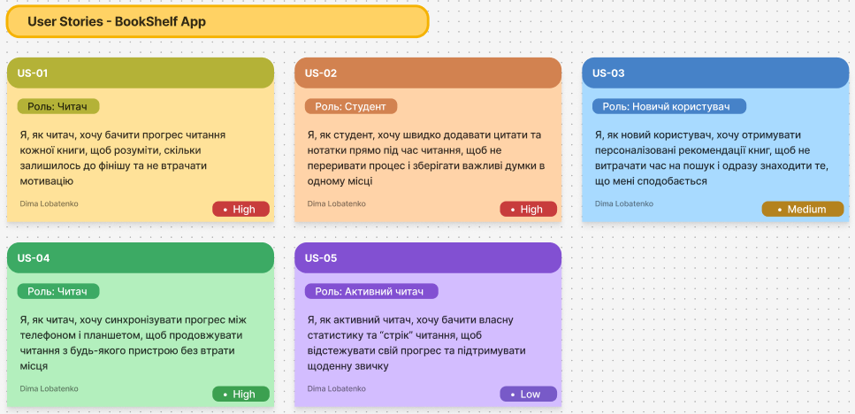
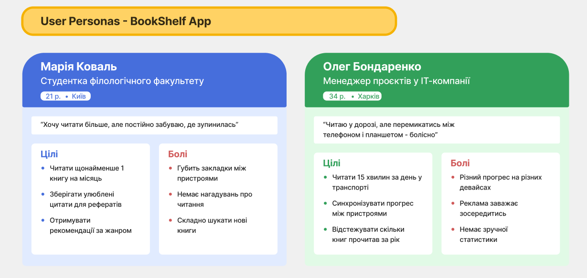
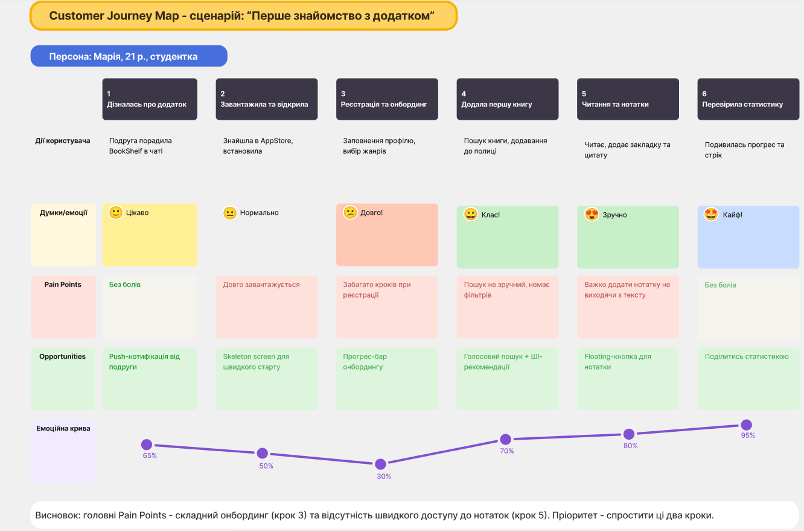

# Лабораторна робота №4
## Дисципліна: Основи UX/UI дизайну
## Тема: UX-дослідження та формування користувацьких вимог (етапи Empathy & Define)
### Виконав: студент групи РПЗ-33, Лобатенко Дмитро

### Мета роботи:
1. Опанувати методику UX-дослідження через аналіз конкурентів та інтерв'ю з користувачами.  
2. Навчитися структурувати отримані дані за допомогою інструментів емпатії.  
3. Сформувати портрет цільової аудиторії та проаналізувати її взаємодію з продуктом через Customer Journey Map (CJM).  
4. Розвинути навички візуальної комунікації ідей на онлайн-дошці FigJam.

### Матеріальне забезпечення занять:  
1. Персональний комп'ютер, доступ до мережі Інтернет.  
2. Обліковий запис Google.  
3. Середовища Figma та FigJam.

### Завдання для попередньої підготовки.

**1. Розглянути матеріали лекції №3.**

**2. Зробіть короткий словник (5-7 термінів) базових понять англ. мовою. Наприклад, Persona, User Story, Touchpoint, Pain Point, Empathy, Journey Map, Prototype тощо.**

_Словник базових понять англ. мовою_

| № | Слово | Пояснення |
| :--- | :--- | :--- |
| 1 | Empathy | Не просто «увійти в становище» користувача, а активно вивчати його поведінку через спостереження та інтерв'ю, щоб зрозуміти справжні, а не вигадані проблеми |
| 2 | User Persona | Збірний образ реального типу користувача, побудований на даних досліджень. Включає мету, поведінкові патерни та больові точки — все те, чого немає у простій демографії |
| 3 | User Story | Формат опису вимоги до продукту з позиції користувача: «Як [роль] я хочу [дія], щоб [цінність]». Фокусує команду на результаті, а не на технічних деталях |
| 4 | Touchpoint | Будь-який момент, коли користувач взаємодіє з продуктом або брендом — від реклами до кнопки «Готово» |
| 5 | Pain Point | Конкретна точка розчарування або труднощі, через яку людина або припиняє дію, або шукає обхідний шлях |
| 6 | Journey Map (CJM) | Візуальна карта повного шляху користувача крізь продукт: що робить, що відчуває, де «ламається» |
| 7 | Prototype | Рання модель інтерфейсу — від паперового скетчу до клікабельного макету — для тестування ідеї до її розробки |
| 8 | Domain Research | Попереднє вивчення галузі: хто є на ринку, як влаштовані конкуренти, які є обмеження — щоб не починати з нуля |
| 9 | User Flow | Покрокова схема шляху користувача до конкретної мети в інтерфейсі, аналог алгоритму в програмуванні |
| 10 | Problem Statement | Стисле та точне формулювання проблеми без підказки рішення — основа для всіх подальших дизайн-рішень |
| 11 | Double Diamond | Модель дизайн-процесу з чотирьох фаз: спочатку розширення і звуження проблеми (Discover→Define), потім — рішення (Develop→Deliver) |
| 12 | Wireframes | Схеми розташування елементів на екрані без кольорів і стилів — перший крок від ідеї до інтерфейсу |
| 13 | Root Cause | Прихована справжня причина проблеми, яку виявляють методом «5 Чому», щоб не лікувати симптоми |
| 14 | Usability Testing | Спостереження за тим, як реальна людина виконує задачу в інтерфейсі, щоб знайти місця, де вона застряє |

**3. Дайте відповіді на наступні питання:**

<blockquote>

**3.1. Що таке Empathy в UX і чому це не те саме, що жалість до користувача?**

Жалість — пасивна: ти бачиш, що людині незручно, і просто співчуваєш. **Емпатія в UX — активна**: дизайнер іде на інтерв'ю, спостерігає за поведінкою, ставить незручні питання і шукає причину, чому виникає «біль». Мета не в тому, щоб пожаліти — мета в тому, щоб знайти проблему й усунути її через продукт.

**3.2.** ***Навіщо потрібна Persona, якщо ми можемо просто описати «всіх людей 18–45 років»?**

Широкий опис аудиторії — це ні про кого конкретно. Студентка, що читає у метро між парами, і батько двох дітей, що читає 15 хвилин перед сном — це люди одного віку, але з абсолютно різними потребами, контекстом і больовими точками. Persona перетворює абстрактну «аудиторію» на конкретну людину, під запити якої можна проєктувати рішення.

**3.3.** ****Що таке Pain Point і як її знайти під час інтерв'ю?**

**Pain Point** — це місце, де щось іде не так: людина гальмує, роздратовується або взагалі кидає задачу. На інтерв'ю їх не знайти прямими запитаннями — «що вам не подобається?» дає поверхневі відповіді. Натомість запитуй про минулий досвід: «Коли востаннє це не вийшло?», «Що ви зробили замість цього?» — і слухай не лише слова, а й паузи та емоції у відповіді.

</blockquote>

**4. Підготувати в електронному вигляді початковий варіант звіту:**

- Титульний аркуш, тема та мета роботи  
- Відповіді до завдань для попередньої підготовки

## Хід роботи

### Практичне завдання №1. Етап Define. Створення User Stories (базовий рівень)

**1. Розглянути додаткові навчальні матеріали та приклади:**

- [Як писати User Stories, щоб було зрозуміло всім](https://iampm.club/ua/blog/yak-pisati-user-stories-shhob-bulo-zrozumilo-vsim/) (рекомендовано усім)
- [User story – що це, для чого і чи можна обійтися без них?](https://brainrain.com.ua/uk/user-story/)
- [User Story в ІТ-проектах: Як писати вимоги з точки зору користувача](https://flexi-project.com/uk/user-story-%D0%B2-%D1%96%D1%82-%D0%BF%D1%80%D0%BE%D0%B5%D0%BA%D1%82%D0%B0%D1%85-%D1%8F%D0%BA-%D0%BF%D0%B8%D1%81%D0%B0%D1%82%D0%B8-%D0%B2%D0%B8%D0%BC%D0%BE%D0%B3%D0%B8-%D0%B7-%D1%82%D0%BE%D1%87%D0%BA/)
- [How to write good User Stories in Agile](https://www.youtube.com/watch?v=7hoGqhb6qAs)
- [20 User story examples and best practices](https://www.justinmind.com/blog/examples-user-story-best-practices/) (рекомендовано усім)

**2. На базі сформованої ідеї та етапу Empathy (див. ЛР №3) у FigJam сформуйте 4-5 User Stories для вашого продукту.**

Формат:  
Я як [роль] хочу [дія], щоб [користь]

### Практичне завдання №2. *Етап Define. Створення User Persona (середній рівень)

**1. Розглянути додаткові навчальні матеріали та приклади:**

- [User Persona ≠ Олег 30 років | Типи UX персон | 15 урок](https://www.youtube.com/watch?v=PLfy1FAMDYI) (рекомендовано усім)
- [How to Create A User Persona in 2026](https://www.youtube.com/watch?v=HkKf3Mhszww)
- [How To Make Persona In FigJam (2026 Guide)](https://www.youtube.com/watch?v=O8nkIOqyAsA) (рекомендовано усім)
- [How to Create a User Persona in Figma](https://www.youtube.com/watch?v=3V4g-FB_Olg)

**2. У FigJam створити дві User Persona для вашого продукту. Коротко опишіть їх.**

Перша персона — **Марія, 21 рік, студентка філологічного факультету**. Читає багато, але хаотично: губить місце в книзі при перемиканні між пристроями, не має звички зберігати цитати, хоче рекомендацій за жанром. Головний біль — відсутність нагадувань і зручних нотаток.

Друга персона — **Олег, 34 роки, IT-менеджер**. Читає короткими сесіями в транспорті. Критична проблема — несинхронізований прогрес між телефоном і планшетом, а також відсутність зручної річної статистики прочитаного.

### Практичне завдання №3. **Етап Define. Створення Customer Journey Map (підвищений рівень)

**1. Розглянути:**

- [CJM — що це таке і як його будувати?](https://www.youtube.com/watch?v=q09sau-hK_I)
- [Як правильно будувати CUSTOMER JOURNEY MAP](https://www.youtube.com/live/x3HFghf-PuU)
- [FigJam tutorial: User journey mapping](https://www.youtube.com/watch?v=L4E1yupkISI)
- [Customer journey mapping in Figjam](https://www.youtube.com/watch?v=Dss4wKk0Dog)

**2. У FigJam створити Customer Journey Map для вашого продукту. Коротко опишіть її.**

CJM побудована для персони Марії в рамках сценарію «Перше знайомство з додатком» — від моменту, коли вона дізналась про BookShelf від подруги, до перевірки власної статистики читання. Карта охоплює шість кроків та фіксує дії, думки, больові точки та можливості на кожному з них.

Найгостріші проблеми виявились на третьому кроці (реєстрація та онбординг) — забагато обов'язкових дій на старті — та на п'ятому (читання з нотатками) — кнопка нотатки захована занадто глибоко. Емоційна крива показує, що початкове зацікавлення різко падає саме на онбордингу, а потім знову зростає, якщо користувач все ж таки дійшов до читання.

На базі карти сформовано два пріоритетних рішення: скоротити онбординг до мінімуму з можливістю пропустити деталі, та додати плаваючу кнопку нотатки прямо в режимі читання.

[Посилання на дошку FigJam](https://www.figma.com/board/Xe4vQAR7SDDlauv58W93fn/UX-UI?node-id=0-1&p=f&t=GjZ2qFEWSbd5FaCY-0)

### Контрольні запитання

**1. Чому User Story обов'язково має закінчуватися частиною «щоб [користь]»?**

Без цієї частини Story перетворюється на технічне завдання: «зробити фільтр пошуку» — і все. Ніхто не розуміє, навіщо. Частина «щоб» примушує сформулювати реальну цінність, яку отримає користувач — і це одразу дає команді критерій для оцінки: чи вирішує функція проблему, чи просто є?

**2.** ***Чому UX-дизайнер має досліджувати саме поведінку (що людина робить), а не її думки (що вона каже, що зробила б)?**

Люди схильні відповідати «як треба», а не «як є насправді». Запитаєш «чи читаєте ви регулярно?» — більшість скаже «так, намагаюсь». Але якщо подивитись на реальні дані або просто попросити показати екран — побачиш зовсім інше. Поведінка не бреше, думки — часто так.

**3.** ****Як Customer Journey Map допомагає команді приймати продуктові рішення?**

CJM робить очевидним те, що інакше залишається розсіяним по записках і головах. Коли вся команда бачить одну карту, вона бачить не «нам треба покращити онбординг», а «ось конкретний крок 3, де 60% користувачів виходять». Це переводить розмову з думок і смаків у площину даних і конкретних точок для виправлення.

## Conclusions

&nbsp;&nbsp;&nbsp;This laboratory work focused on the first diamond of the Double Diamond framework — Empathy and Define. The main takeaway is that research is not a formality before design: it is the design in its early stage.  
&nbsp;&nbsp;&nbsp;Creating User Stories pushed me to think about value first and features second. Building Personas made the research data feel real — it is much easier to design for Mariia with her specific reading habits than for an abstract "18–45 age group". The Customer Journey Map, in turn, showed exactly where the BookShelf app would lose users if built without these insights: the onboarding and the in-reading note experience.  
&nbsp;&nbsp;&nbsp;The core lesson is simple: researching behavior rather than opinions gives you reliable data to build on. Everything else — wireframes, prototypes, UI — comes after that foundation is solid.

