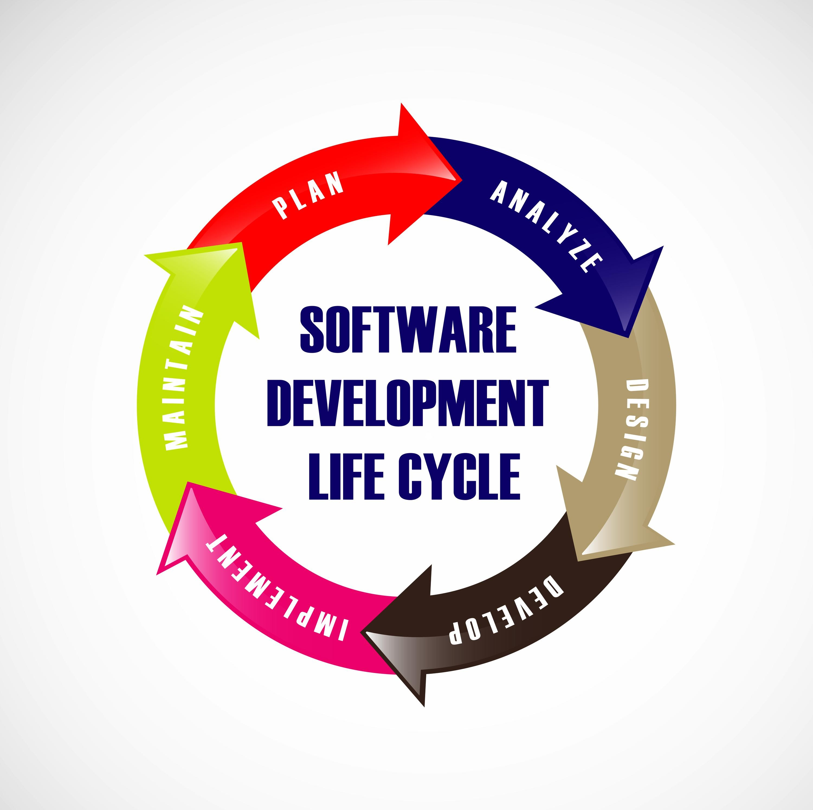

# Самостійна робота студента.
## Виконав: студент групи РПЗ-33, Лоботенко Дмитро

## 1. Контрольні запитання:

- **Чим відрізняється вебсайт від вебзастосунку?**

  *__Вебсайт__ — це передусім інформаційний ресурс, що складається зі статичних сторінок. Користувач тут виступає як читач, а його активність мінімальна (блоги, візитки). 
  __Вебзастосунок__ — це інструмент для активної взаємодії, що обробляє дані у реальному часі. Він передбачає складну логіку, роботу з акаунтами та реакцію системи на кожен крок користувача (CRM-системи, редактори коду, банкінг).*

- **Які етапи життєвого циклу вебпроєкту є критичними для UX/UI дизайнера?**

<blockquote>

  **Етап 1. Аналітика та стратегія.**
  Збір бізнес-вимог та визначення цільової аудиторії. Тут UX-дизайнер формує "Портрет користувача", щоб розуміти, для кого створюється продукт.

  **Етап 2. Пошук стилю та референсів.**
  Дизайнер аналізує ринок та створює мудборди (Moodboards) на основі референсів з Behance чи Dribbble для візуального напрямку.
  
  **Етап 3. UX-проєктування.**
  Розробка User Stories та побудова логічних схем — вайрфреймів (Wireframes). Це етап створення "скелета" майбутнього інтерфейсу.
  
  **Етап 4. UI-візуалізація.**
  Наповнення схем кольорами, типографікою та іконками. Тут створюються Mockups — кольорові макети високої деталізації.

  **Етап 5. Прототипування та презентація.**
  Підготовка інтерактивної моделі для перевірки зручності та затвердження ідеї замовником.

  **Етап 6. Підготовка ресурсів (Handoff).**
  Дизайнер формує Design System та експортує графіку в SVG/PNG для розробників.

  **Етапи 9-10. Тестування та авторський нагляд.**
  Перевірка готового коду на відповідність дизайну (Pixel Perfect) та виправлення помилок у зручності використання.
  
</blockquote>

- **У чому полягає цінність прототипування?**

  *Цінність у можливості створити робочу модель продукту без написання коду. Це дозволяє замовнику "відчути" застосунок ще до старту розробки, що мінімізує ризики помилок у логіці та значно економить час програмістів на подальше перероблювання.*
  
- **У чому різниця між UX Researcher та UI Designer?**

  *__UX Researcher (Дослідник)__ зосереджений на зборі даних, проведенні інтерв'ю та побудові гіпотез щодо поведінки користувачів. Він відповідає за те, щоб продукт був логічним. __UI Designer__ працює з візуальним рівнем: підбирає кольори, будує сітки та створює естетичний образ, що викликає емоційний відгук.*
  
- **Поясніть різницю між Frontend та Backend простими словами?**

  *__Frontend__ — це все, що користувач бачить на екрані та з чим безпосередньо взаємодіє (візуальна "лицьова" частина). __Backend__ — це прихована серверна логіка, яка обробляє запити, зберігає дані в базах та забезпечує роботу функцій "всередині".*

# 2. Питання на дослідження

- **Розкрийте поняття SDLC (Software Development Life Cycle) на прикладі розробки мобільної гри.**

<blockquote>
 

  **SDLC** — це циклічний процес створення ПЗ, що гарантує якість продукту. Розглянемо на прикладі стратегії **"Mars Colony"**:

  1. **Аналітика та концепція**: Вивчення ринку ігор про космос, написання документації з механіками будівництва бази.
  2. **Фаза дизайну**: Створення мап рівнів, проєктування інтерфейсу (UX) та малювання текстур ресурсів (UI). Створення прототипу ігрового меню.
  3. **Implementation (Кодинг)**: Програмування фізики на рушії та налаштування серверів для мультиплеєра (Backend).
  4. **Quality Assurance**: Тестування гри на баги, баланс складності та швидкість роботи на смартфонах.
  5. **Деплой та підтримка**: Реліз гри у маркетах та регулярний випуск оновлень на основі відгуків гравців.
   
</blockquote>

- **Побудуйте схему життєвого циклу вебпроєкту з позначенням ролі UX/UI дизайнера на відповідних етапах.**
  
1.  **Аналіз**: Роль дизайнера — дослідження користувачів та конкурентів.  
2.  **Концепція**: Підбір візуальних референсів та створення мудбордів.  
3.  **UX-проєктування**: Створення вайрфреймів та схем навігації.  
4.  **UI-дизайн**: Візуалізація сторінок, розробка іконок та компонентів.  
5.  **Прототип**: Складання клікабельної моделі для презентації.  
6.  **Handoff**: Експорт графіки та опис логіки для розробників.  
7.  **Верстка**: Контроль якості (Design Review) під час створення Frontend.  
8.  **Тестування**: Перевірка Pixel Perfect та юзабіліті-аудит.
   
- **Дослідіть поняття T-shaped skills для сучасних ІТ-спеціаліста з розробки ПЗ.**

  *Поняття **T-shaped skills** описує фахівця, який має глибоку експертизу у своїй основній ніші (вертикаль) та широкі базові знання у суміжних сферах (горизонталь). Для дизайнера це означає:
  * **Глибокі навички (вертикаль)**: Figma, UI-дизайн, прототипування, інформаційна архітектура.
  * **Суміжні навички (горизонталь)**: Розуміння основ верстки (HTML/CSS), щоб знати межі технічної реалізації, навички копірайтингу (UX Writing) та базове розуміння бізнес-метрик. Такий підхід допомагає команді швидше знаходити спільну мову та створювати цілісні продукти.*

- **Знайти на сайтах пошуку роботи (Djinni, Work.ua) 2 вакансії: "UI/UX Designer" та "Web Designer". Порівняти вимоги до Hard Skills.**

  | Критерій порівняння | UI/UX Designer | Web Designer |
  | :--- | :--- | :--- |
  | **Фокус роботи** | Проєктування досвіду та логіки складних сервісів | Створення візуального контенту та лендінгів |
  | **Ключові Hard Skills** | Figma (Design Systems, Auto Layouts), Wireframing | Figma, Adobe Photoshop, Illustrator, ретуш |
  | **Аналітична складова** | User Stories, CJM, юзабіліті-тестування | Знання композиції, кольористики та типографіки |
  | **Технічне розуміння** | Глибоке розуміння SDLC та етапу Handoff | Часто вимагається знання Tilda, Webflow чи HTML/CSS |
  | **Головна мета** | Зробити продукт зрозумілим та функціональним | Зробити продукт естетично привабливим та рекламним |
